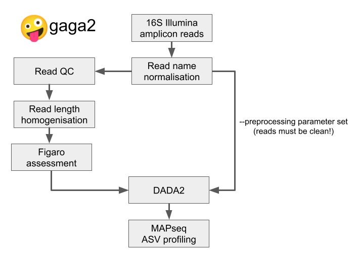

# gaga2 - automated 16S amplicon analysis with Figaro/DADA2



## Installation instructions
`gaga2` requires a working `nextflow` installation (v20.4+). 

Other dependencies:
* bbmap 
* fastqc
* figaro
* R v4+ with dada2, devtools, tidyverse, and cowplot installed
* MapSeq

For convenience, `gaga2` comes with a Singularity container with all dependencies installed. 

```singularity pull oras://ghcr.io/zellerlab/gaga2:latest```

#### MapSeq
While most dependencies can be installed via conda, `MapSeq` can not. If you don't want / can't use the `gaga2` singularity container, you need to make `gaga2` aware of your own MapSeq installation. In this case (and only in this case!), please modify the following entries in the `run.config`:
* `mapseq_bin` should be the path to your `mapseq` binary; if `mapseq` is in your `$PATH`, you can leave this entry unchanged.
* `mapseq_db_path` is the `dirname` of the path to your `mapseq` database, i.e. for `/path/to/mapseq_db_folder/` it is `/path/to/`.
* `mapseq_db_name` is the `basename` of the path to your `mapseq` database, i.e. for `/path/to/mapseq_db_folder/` it is `mapseq_db_folder`.


## Usage instructions

### Input
`gaga2` takes as input Illumina paired-end 16S amplicon sequences (e.g. sequenced on a MiSeq).

#### Prerequisites
* Read files need to be named according the typical pattern `<prefix=sample_id>_R?[12].{fastq,fq,fastq.gz,fq.gz}`.
They should, but don't have to, be arranged in a sample-based directory structure:

```
<project_dir> (aka "input_dir")
     |___ <sample_1>
     |        |____ <sample_1_forward_reads>_R?1.{fastq,fq,fastq.gz,fq.gz}
     |        |____ <sample_2_reverse_reads>_R?2.{fastq,fq,fastq.gz,fq.gz}
     |
     |___ <sample_2>
     |        |____ <empty samples will be ignored>
     |        
     |___ <sample_n>
              |____ <sample_n_forward_reads>_R?1.{fastq,fq,fastq.gz,fq.gz}
              |____ <sample_n_reverse_reads>_R?2.{fastq,fq,fastq.gz,fq.gz}
```

A flat directory structure (with all read files in the same directory) or a deeply-branched (with read files scattered over multiple levels) should also work. 

If `gaga2` preprocesses the reads, it will automatically use `_R1/2` endings internally.

* If input reads have already been preprocessed, you can set the `--preprocessed` flag. In this case, `gaga2` will do no preprocessing at all and instruct `dada2` to perform no trimming. Otherwise, `gaga2` will preprocess the reads with `bbduk`. If primer sequences are given via `--primers <fwd_primer>[,<rev_primer>]`, `bbduk` will attempt to remove them + any up/downstream adapter remains. Otherwise, `bbduk` will attempt to remove adapter remains only. Reads are then cut to a uniform length (all forward reads across all samples and all reverse reads across all samples need to have the length, but forward and reverse reads may differ in length.) The latter treatment is a requirement for `figaro`, which will then take the primer lengths (supplied via `--left_primer` and `--right_primer`) into account when determining the optimal cut sites.

* Samples with less than `110` reads after `dada2` preprocessing, will be discarded.

### Running gaga2

`gaga2` can be directly run from github. 

`nextflow run zellerlab/gaga2 <parameters>`

To obtain a newer version, do a 

`nextflow pull zellerlab/gaga2`

before.

In addition, you should obtain a copy of the `run.config` from the `gaga2` github repo and modify it according to your environment.

Additional arguments can be set via the command line (e.g. `--input_dir /path/to/input_dir`) or in the params section of the `run.config` file (recommended for documentation and reproducibility purposes.)

#### Mandatory arguments
* `--input_dir` is the project directory mentioned above.
* `--output_dir` will be created automatically.
* `--amplicon_length` this is derived from your experiment parameters (this is not read-length, but the length of the, well, amplicon!)
* `--single_end` this is only required for single-end libraries (auto-detection of library-type is in progress)

#### Optional arguments
* `--min_overlap` of read pairs is `20bp` by default
* `--primers <comma-separated-list-of-primer-sequences>` or `--left_primer`, and `--right_primer` If primer sequences are provided via `--primers`, `gaga2` will remove primers and upstream sequences (using `bbduk`), such as adapters based on the primer sequences. If non-zero primer lengths are provided instead (via `--left_primer` and `--right_primer`), `figaro` will take those into account when determining the best trim positions.
* `--preprocessed` will prevent any further preprocessing by `gaga2` - this flag should only be used if the read data is reliably clean.
* `--qc_minlen` sets the minimum length for reads to be retained after preprocessing.
* `--dada2_chimera_method` sets the method with which `dada2` will remove chimeras (default: `"consensus"`, alternative: `"pool"`)
* `--dada2_chimera_min_fold_parent_over_abundance` sets the `minFoldParentOverAbundance` parameter for `removeBimeraDeNovo` (default: `2`)


### internal beta-testing instructions
* The old gaga2 version can be run with `source /g/scb2/zeller/schudoma/software/wrappers/gaga2_wrapper` **before** submitting job to cluster
* Please report issues/requests/feedback in the github issue tracker 
* If you want to run `gaga2` on the cluster, `nextflow` alone requires `>=5GB` memory just for 'managing'.

